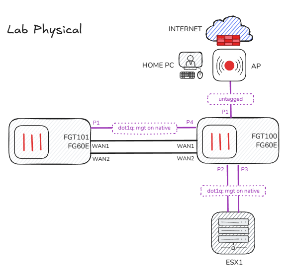
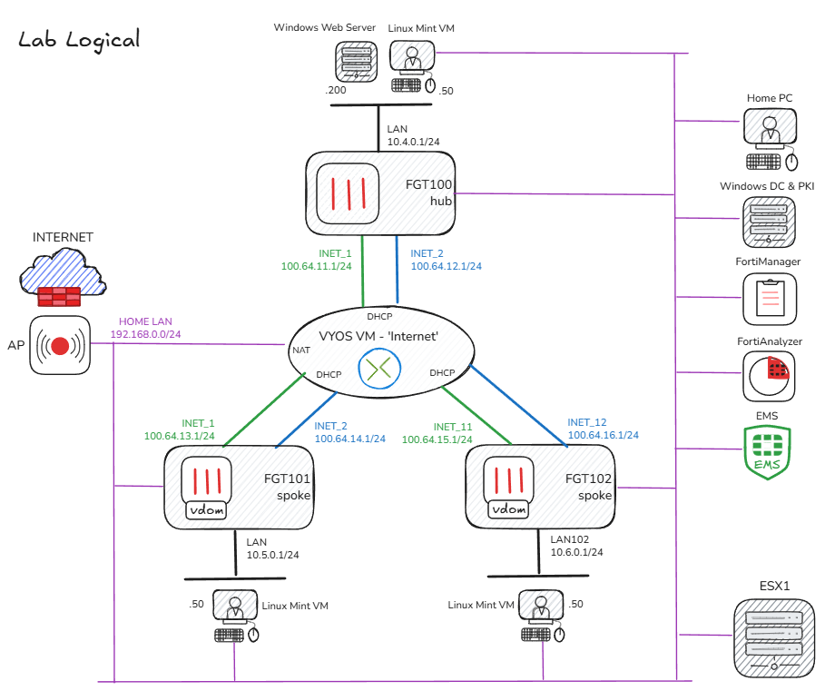

# Fortinet Home Lab Setup

## Contents
- [Introduction](#introduction)
- [Lab Components](#lab-components)
  - [Hardware](#hardware)
  - [Virtual Machines](#virtual-machines)
- [Physical Topology](#physical-topology)
- [Logical Topology](#logical-topology)

## Introduction
This document outlines the home lab setup I use for learning, testing, and validating Fortinet products and network architectures. It's built with a focus on Fortinet SD-WAN, ZTNA and central management via FortiManager/FortiAnalyzer, but is flexible enough for broader security and networking scenarios.

## Lab Components

### Hardware
- **2 × FortiGate 60E**
  - Running FortiOS 7.4
- **1 × Dell PowerEdge T130**
  - Intel Xeon E3-1200 (Quad Core)
  - 64 GB RAM
  - ESXi 6.7 Hypervisor
- **My Home Laptop**
  - Lab workstation - running all the tools you'd expect from a seasoned networking nerd!

### Virtual Machines

- **FortiManager** - Free trial license (limited to 3 Devices/VDOMs)
- **FortiAnalyzer** - Free trial license (limited to 3 Devices/VDOMs)
- **EMS Server** - Free Trial (limited to 3 endpoints)
- **VyOS Stream** - Virtual Router
- **Windows Server 2016** – Domain Controller + PKI
- **Windows Server 2016** – IIS Web Server
- **Windows 10** – Domain-joined workstation
- **Linux Mint VMs** – for traffic generation and testing

> NOTE: There is also a FortiGate free trial on the ESX host. It's limited to 3 interfaces and weak ciphers, but still useful in some scenarios. The biggest challenge I've found is not being able to add it to FortiManager due to the weak ciphers.

## Physical Topology

### Notes

The internal switch on the FGT100 provides Layer 2 connectivity across all physical and virtual lab components, eliminating the need for a separate physical switch. This switch also connects to a non-Fortinet wireless access point, which bridges the lab environment to the home LAN and internet.

Combined with virtual networking on the ESXi host, this setup offers significant flexibility for modifying the logical topology as needed — ideal for experimenting with routing, segmentation, or SD-WAN scenarios.

The direct WAN-to-WAN connections between the two FortiGates are used for ad hoc scenarios, such as quickly spinning up IPsec VPNs.

## Logical Topology

### Lab Management

All physical and virtual devices in the lab are connected to my home LAN (`192.168.0.0/24`), ensuring consistent management access across the environment. For Linux-based VMs, a secondary vNIC is added to connect them to the management LAN specifically for this purpose.

Core services such as FortiManager, FortiAnalyzer, and the Windows Domain Controller communicate with lab components over this management network, enabling centralized logging, configuration, and directory integration.

Outbound internet access for lab systems is also routed via the home LAN and upstream fibre connection.

### ESX Networking

The default **VM Network** port group is used for managing the ESXi host and extending the home management LAN to the virtual machines.

Additional port groups are created for each lab VLAN as needed. These are configured as VLAN trunks and connected to the internal switch on the FGT100, allowing the FortiGate to handle VLAN tagging and routing for lab segments.

