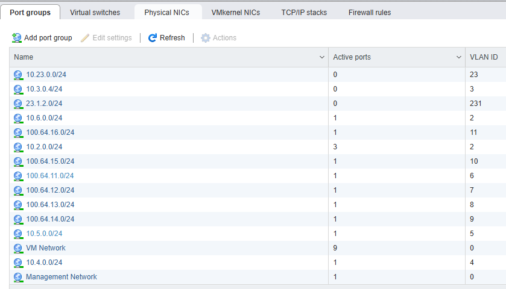

# Fortinet Home Lab Setup

## Contents
- [Introduction](#introduction)
- [Lab Components](#lab-components)
  - [Hardware](#hardware)
  - [Virtual Machines](#virtual-machines)
- [Physical Topology](#physical-topology)
- [Logical Topology and Configuration](#logical-topology-and-configuration)
  - [Lab Management](#lab-management)
  - [ESX Networking](#esx-networking)
  - [FortiGate Internal Switch](#fortigate-internal-switch)
  - [FortiGate VDOMs](#fortigate-vdoms)
  - [VyOS Virtual Router](#vyos-virtual-router)
- [Conclusion](#conclusion)

## Introduction
This document outlines the home lab setup I use for learning, testing, and validating Fortinet products and network architectures. It's built with a focus on Fortinet SD-WAN, ZTNA and central management via FortiManager/FortiAnalyzer, but is flexible enough for broader security and networking scenarios.

The lab environment is small and compact, but does enable a surprisingly wide range of scenarios all with minimal cost, power consumption, and physical footprint. 

## Lab Components

### Hardware
- **2 × FortiGate 60E**
  - Running FortiOS 7.4
- **1 × Dell PowerEdge T130**
  - Intel Xeon E3-1200 (Quad Core)
  - 64 GB RAM
  - ESXi 6.7 Hypervisor
- **Lab Workstation**
  - Windows 10
  - Running all the tools you'd expect from a seasoned networking nerd!

### Virtual Machines

- **FortiManager** - [Free trial](https://docs.fortinet.com/document/fortimanager/7.6.0/vm-trial-license-guide/273638/activating-a-free-trial-of-fortimanager-vm) (limited to 3 Devices/VDOMs)
- **FortiAnalyzer** - [Free trial](https://docs.fortinet.com/document/fortianalyzer/7.6.0/vm-trial-license-guide/273638/activating-a-free-trial-of-fortianalyzer-vm) (limited to 3 Devices/VDOMs)
- **EMS Server** - [Free Trial](https://docs.fortinet.com/document/forticlient/7.4.0/licensing-guide/883953/free-trial-license_)  (limited to 3 endpoints)
- **VyOS Stream** - [Free](https://vyos.net/get/stream/) Virtual Router
- **Windows Server 2016** – Domain Controller + PKI
- **Windows Server 2016** – IIS Web Server
- **Windows 10** – Domain-joined workstation
- **Linux Mint VMs** – for traffic generation and testing

> NOTE: There is also a [FortiGate free trial](https://docs.fortinet.com/document/fortigate/7.6.3/administration-guide/441460) deployed on the ESX host. It's limited to 3 interfaces and weak ciphers, but still useful in some scenarios. The biggest challenge I've found is not being able to add it to FortiManager due to the weak ciphers.

## Physical Topology


### Notes

The internal switch on the FGT100 provides Layer 2 connectivity across all physical and virtual lab components, eliminating the need for a separate physical switch. This switch also connects to a non-Fortinet wireless access point, which bridges the lab environment to the home LAN and internet.

Combined with virtual networking on the ESXi host, this setup offers significant flexibility for modifying the logical topology as needed — ideal for experimenting with routing, segmentation, or SD-WAN scenarios.

The direct WAN-to-WAN connections between the two FortiGates are used for ad hoc scenarios, such as quickly spinning up IPsec VPNs.


## Logical Topology and Configuration


### Lab Management

All physical and virtual devices in the lab are connected to my home LAN (`192.168.0.0/24`), ensuring consistent management access across the environment. For Linux-based VMs, a secondary vNIC is added to connect them to the management LAN specifically for this purpose.

Core services such as FortiManager, FortiAnalyzer, and the Windows Domain Controller communicate with lab components over this management network, enabling centralized logging, configuration, and directory integration.

Outbound internet access for lab systems is also routed via the home LAN and upstream fibre connection.

### ESX Networking



The default **VM Network** port group is used for managing the ESXi host and extending the home management LAN to the virtual machines.

Additional port groups are created for each lab VLAN as needed. These are configured as VLAN trunks and connected to the internal switch on the **FGT100**, allowing the FortiGate to handle VLAN tagging and routing for lab segments.

### FortiGate Internal Switch

Below is the interface configuration used on **FGT100** to support both the lab management network and VLAN-tagged lab segments:

```
config system interface
    edit "internal1"
        set vdom "root"
        set type physical
    next
    edit "internal2"
        set vdom "root"
        set type physical
    next
    edit "internal3"
        set vdom "root"
        set type physical
    next
    edit "internal4"
        set vdom "root"
        set type physical
    next
    edit "internal"
        set vdom "root"
        set ip 192.168.0.113 255.255.255.0
        set allowaccess ping https ssh fgfm fabric
        set type hard-switch
        set stp enable
        set role lan
	next
    edit "LAN"
        set vdom "root"
        set ip 10.4.0.1 255.255.255.0
        set allowaccess ping
        set device-identification enable
        set role lan
        set ip-managed-by-fortiipam disable
        set interface "internal"
        set vlanid 4
    next
    edit "INET_1"
        set vdom "root"
        set mode dhcp
        set allowaccess ping
        set device-identification enable
        set role wan
        set interface "internal"
        set vlanid 6
    next
    edit "INET_2"
        set vdom "root"
        set mode dhcp
        set allowaccess ping
        set device-identification enable
        set role wan
        set interface "internal"
        set vlanid 7
    next
end
```

### FortiGate VDOMs
**FGT101** is running in multi-vdom mode to provide 2 virtual firewalls emulating 2 different sites.

```set vdom-mode multi-vdom```

### VyOS Virtual Router
VyOS serves as the central lab router, providing:
- Layer 3 routing between FortiGate WAN VLANs
- DHCP for underlay links to each FortiGate
- NAT and default gateway to the internet via the home LAN

Below is the relevant configuration for interfaces, NAT, static routing, and per-site DHCP services:

```
set interfaces ethernet eth0 address '192.168.0.118/24'
set interfaces ethernet eth0 description 'FGT100-INET_1'
set interfaces ethernet eth1 address '100.64.11.254/24'
set interfaces ethernet eth1 description 'FGT100-INET_1 VLAN6'
set interfaces ethernet eth2 address '100.64.12.254/24'
set interfaces ethernet eth2 description 'FGT100-INET_2 VLAN7'
set interfaces ethernet eth3 address '100.64.13.254/24'
set interfaces ethernet eth3 description 'FGT101-INET_1 VLAN8'
set interfaces ethernet eth4 address '100.64.14.254/24'
set interfaces ethernet eth4 description 'FGT101-INET_2 VLAN9'
set interfaces ethernet eth5 address '100.64.15.254/24'
set interfaces ethernet eth5 description 'FGT102-INET_1 VLAN10'
set interfaces ethernet eth6 address '100.64.16.254/24'
set interfaces ethernet eth6 description 'FGT102-INET_2 VLAN11'
set nat source rule 100 outbound-interface name 'eth0'
set nat source rule 100 source address '0.0.0.0/0'
set nat source rule 100 translation address 'masquerade'
set protocols static route 0.0.0.0/0 next-hop 192.168.0.1
set service dhcp-server shared-network-name FGT100-1 authoritative
set service dhcp-server shared-network-name FGT100-1 subnet 100.64.11.0/24 option default-router '100.64.11.254'
set service dhcp-server shared-network-name FGT100-1 subnet 100.64.11.0/24 range 0 start '100.64.11.1'
set service dhcp-server shared-network-name FGT100-1 subnet 100.64.11.0/24 range 0 stop '100.64.11.1'
set service dhcp-server shared-network-name FGT100-1 subnet 100.64.11.0/24 subnet-id '1'
set service dhcp-server shared-network-name FGT100-2 authoritative
set service dhcp-server shared-network-name FGT100-2 subnet 100.64.12.0/24 option default-router '100.64.12.254'
set service dhcp-server shared-network-name FGT100-2 subnet 100.64.12.0/24 range 0 start '100.64.12.1'
set service dhcp-server shared-network-name FGT100-2 subnet 100.64.12.0/24 range 0 stop '100.64.12.1'
set service dhcp-server shared-network-name FGT100-2 subnet 100.64.12.0/24 subnet-id '2'
set service dhcp-server shared-network-name FGT101-1 authoritative
set service dhcp-server shared-network-name FGT101-1 subnet 100.64.13.0/24 option default-router '100.64.13.254'
set service dhcp-server shared-network-name FGT101-1 subnet 100.64.13.0/24 range 0 start '100.64.13.1'
set service dhcp-server shared-network-name FGT101-1 subnet 100.64.13.0/24 range 0 stop '100.64.13.1'
set service dhcp-server shared-network-name FGT101-1 subnet 100.64.13.0/24 subnet-id '3'
set service dhcp-server shared-network-name FGT101-2 authoritative
set service dhcp-server shared-network-name FGT101-2 subnet 100.64.14.0/24 option default-router '100.64.14.254'
set service dhcp-server shared-network-name FGT101-2 subnet 100.64.14.0/24 range 0 start '100.64.14.1'
set service dhcp-server shared-network-name FGT101-2 subnet 100.64.14.0/24 range 0 stop '100.64.14.1'
set service dhcp-server shared-network-name FGT101-2 subnet 100.64.14.0/24 subnet-id '4'
set service dhcp-server shared-network-name FGT102-1 authoritative
set service dhcp-server shared-network-name FGT102-1 subnet 100.64.15.0/24 option default-router '100.64.15.254'
set service dhcp-server shared-network-name FGT102-1 subnet 100.64.15.0/24 range 0 start '100.64.15.1'
set service dhcp-server shared-network-name FGT102-1 subnet 100.64.15.0/24 range 0 stop '100.64.15.1'
set service dhcp-server shared-network-name FGT102-1 subnet 100.64.15.0/24 subnet-id '5'
set service dhcp-server shared-network-name FGT102-2 authoritative
set service dhcp-server shared-network-name FGT102-2 subnet 100.64.16.0/24 option default-router '100.64.16.254'
set service dhcp-server shared-network-name FGT102-2 subnet 100.64.16.0/24 range 0 start '100.64.16.1'
set service dhcp-server shared-network-name FGT102-2 subnet 100.64.16.0/24 range 0 stop '100.64.16.1'
set service dhcp-server shared-network-name FGT102-2 subnet 100.64.16.0/24 subnet-id '6'
set service ssh port '22'
set system host-name 'rtr1'
```

## Conclusion
This lab setup continues to evolve, but its core design provides a flexible and low-footprint environment for experimenting with Fortinet and other technologies.


